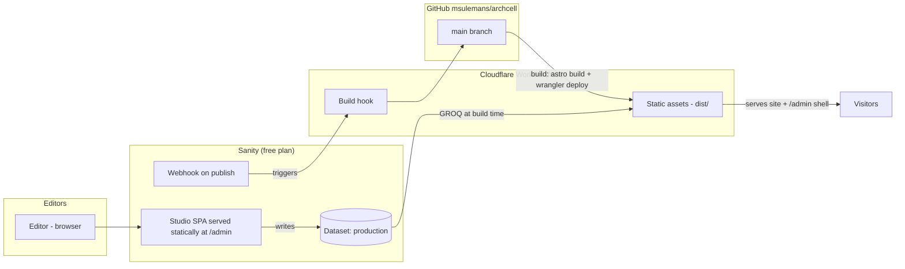

# Archcell → Astro + Sanity + Cloudflare — Migration Plan

> Status: **Phases 0–2 complete; main is the live source.** The site is live at
> https://archcelldesign.com with content from Sanity (project `p8jvt4z4`) and the embedded
> Studio at https://archcelldesign.com/admin. The deploy workflow is in place; two account
> steps remain (see Phase 3) to make publishes rebuild the site automatically.
> Decisions recorded 2026-09-13 from planning conversation.

## 1. Goal

Convert the hand-built static site (generator script + HTML fragments + vanilla JS) into an
**Astro** project that:

1. Renders the identical design (pixel parity is the acceptance bar).
2. Uses **real URLs** for projects instead of hash routes.
3. Gets **all content editable in Sanity** (free plan), with a Studio dashboard embedded on
   the same domain.
4. Deploys to **Cloudflare** (free plan) from the existing GitHub repo
   (`msulemans/archcell`), rebuilding automatically when editors publish.

## 2. Decisions (from planning Q&A)

| Question | Decision |
| --- | --- |
| Sanity project | **Create a brand-new Sanity project** (free tier) |
| Editable in Sanity | Projects, drawings, images/credits, site settings — goal is *everything*, staged |
| URL structure | **Real routes**: `/projects/<slug>/` and `/projects/<slug>/drawings/` |
| Enquiry form | Stays a **demo** (client-side, downloadable brief) |
| Studio hosting | **Embedded in the same deploy** (same Cloudflare domain) |
| Frontend hosting | **Cloudflare free**, Sanity free tier |

### ⚠️ Route collision found during planning

The site already has a page called **“The Studio” at `/studio/`**. The embedded Sanity
Studio must therefore live at **`/admin/`** (the integration’s conventional path) — not
`/studio/`. If you’d rather the dashboard be at another path (e.g. `/dashboard`), say so;
it’s a one-line config change.

## 3. Target architecture



**Rendering model:** fully **static** (Astro default `output: 'static'`).
Content is fetched from Sanity **at build time**; publishing in Sanity triggers a rebuild
(≈1–2 min) via webhook → Cloudflare build hook. No SSR, no adapter, no runtime token.

**Why this is safe:** the official `@sanity/astro` integration explicitly supports embedding
Studio with `output: 'static'` — it falls back to **hash-based routing** for the Studio
(e.g. `/admin#/structure`). Server output + adapter is only required later if we add
Visual Editing / draft previews (kept as an optional phase — the upgrade path is a config
change plus `nodejs_compat`).

## 4. Route map

| Current | New | Notes |
| --- | --- | --- |
| `/` | `/` | Homepage; sections become components |
| `/studio/` | `/studio/` | Unchanged (about page) |
| `/services/` | `/services/` | Unchanged |
| `/process/` | `/process/` | Unchanged |
| `/projects/` | `/projects/` | Archive + filters |
| `#project/<id>` (hash on any page) | `/projects/<slug>/` | **New real URL** |
| `#project/<id>/drawings` | `/projects/<slug>/drawings/` | **New real URL** |
| `/drawings/` | `/drawings/` | Project→drawing archive |
| `/contact/` | `/contact/` | `?service=Interiors` prefill keeps working |
| `/privacy/` | `/privacy/` | Unchanged |
| `/404.html` | `/404.html` | Astro `src/pages/404.astro` |
| — | **`/admin/`** | Embedded Sanity Studio (new) |

**Legacy compatibility:** a tiny script runs on every page; if `location.hash` matches
`#project/<id>` or `#project/<id>/drawings`, it `location.replace()`s to the new URL.
Any shared/bookmarked hash links keep working.

**Canonical origin:** replaced from the hardcoded
`https://archcell-atelier.aunabbas572.chatgpt.site` to an env-driven `SITE_URL`
(workers.dev URL first, custom domain later).

## 5. File-by-file mapping

| Current file | Becomes |
| --- | --- |
| `build-pages.mjs` (header/footer/nav strings) | `src/components/SiteHeader.astro`, `SiteFooter.astro`, `MobileNav.astro` |
| `build-pages.mjs` (page title/description map) | per-page `<BaseLayout>` props (later: Sanity) |
| `build-pages.mjs` (canonical injection) | `BaseLayout.astro` using `SITE_URL` env |
| `dist/index.html` sections | `src/pages/index.astro` + `src/components/home/*` (Hero, Intro, WorkGrid, Interlude, DrawingRoom, Studio) |
| `pages/studio.html` | `src/pages/studio.astro` |
| `pages/services.html` | `src/pages/services.astro` |
| `pages/process.html` | `src/pages/process.astro` |
| `pages/projects.html` | `src/pages/projects/index.astro` |
| `pages/drawings.html` | `src/pages/drawings.astro` |
| `pages/contact.html` | `src/pages/contact.astro` |
| `pages/privacy.html` | `src/pages/privacy.astro` |
| `pages/404.html` | `src/pages/404.astro` |
| `renderDetail()` template in `app.js` | `src/pages/projects/[slug].astro`, `src/pages/projects/[slug]/drawings.astro` + components |
| `projects[]` array (app.js) | Sanity `project` documents |
| `sheets[]` array (app.js) | Sanity `drawing` documents |
| `credits[]` array (app.js) | Sanity `credit` documents |
| `drawingSVG()` generator (app.js) | `src/lib/drawings.ts` — runs at **build time**, so sheet SVGs are server-rendered |
| `dist/style.css` | `src/styles/global.css` (imported in layout, processed by Vite) |
| `dist/pages.css` | `src/styles/interior.css` |
| `dist/app.js` (menu, reveals, transitions, cursor, dialogs) | `src/scripts/site.js` + `src/scripts/viewer.js` |
| `dist/pages.js` (filter, form) | `src/scripts/filter.js` + `src/scripts/contact.js`; archive list becomes server-rendered |
| `dist/assets/*.jpg` | uploaded to Sanity during seed; originals kept in `public/assets/` as build-time fallback |
| `dist/assets/credits.json` | Sanity `credit` docs (+ license text in `siteSettings`) |
| `.openai/hosting.json`, `build-pages.mjs`, `pages/`, old `dist/` | **deleted** after parity is verified |

## 6. Sanity content model

### Documents

**`project`**
| Field | Type | Notes |
| --- | --- | --- |
| `name` | string, required | |
| `slug` | slug (from name), required | drives `/projects/<slug>/` |
| `location` | string | e.g. “DHA, Lahore” |
| `type` | string, options: `Residential`, `Interiors` | drives filters |
| `area` | string | e.g. “1 kanal” |
| `year` | string | displayed as-is |
| `theme` | string | the “THE IDEA” headline |
| `description` | text | |
| `materials` | string | material palette line |
| `image` | image (hotspot) | card + hero image |
| `gallery` | array of images | detail-page image pair |
| `featured` | boolean | hero “FEATURED / …” link target |
| `order` | number | grid ordering |

**`drawing`**
| Field | Type | Notes |
| --- | --- | --- |
| `code` | string | e.g. `A-101` |
| `name` | string | e.g. “Ground floor plan” |
| `category` | string, options: Architecture / Elevations / Structural / Electrical / Plumbing / Interiors | drives catalogue filters |
| `kind` | string, options = the **18 diagram kinds** | selects which generated SVG is drawn |
| `order` | number | |

> The drawings are **generated diagrams**, not uploaded files. Each `kind` maps to a fixed
> SVG drawing routine. Editors can rename/reorder/recode sheets and choose a `kind`; adding a
> *brand-new diagram style* still needs a small code change (documented in Studio helper text).
> Optional later: a “custom SVG upload” override field per sheet.

**`credit`** — `name`, `usedFor`, `url`, `order`.

**`siteSettings`** (singleton) — contact email / whatsapp / address / address note; stats
(years + projects, labels and suffixes); footer statement + fine print + copyright; SEO
defaults (title, description, default OG image); credits-dialog intro + license note.

**`homePage`** (singleton) — hero (eyebrow, title, paragraph, topline texts, coordinates
label, image, featured-project reference); intro section; “selected work” headings + note;
interlude copy + image; drawing-room section copy; studio section copy + image.

### Phase 4 extends coverage
Eight per-page singletons (`studioPage`, `servicesPage`, `processPage`, `projectsPage`,
`drawingsPage`, `contactPage` incl. FAQ, `privacyPage`, `notFoundPage`) so **every visible
string** is editable: named string fields for headings + Portable Text for paragraphs +
object arrays for cards/steps/FAQ. Layout and CSS classes stay fixed.

### Image strategy
Project and section images are uploaded to Sanity (hotspot support) and served from the
Sanity CDN with `@sanity/image-url` (width/format params). `public/assets/` keeps the
originals as a safety net for the first build.

## 7. JavaScript migration

The site’s JS is small and framework-free; it stays vanilla, split into modules loaded only
by the pages that need them:

| Feature | Strategy |
| --- | --- |
| Mobile menu + focus trap | `site.js` (global) — ported as-is |
| Reveal-on-scroll observer | `site.js` (global) |
| Page-transition overlay, cursor label, back-to-top | `site.js` (global) |
| Credits dialog | `site.js`, content server-rendered from Sanity |
| Project grid + archive list | **Server-rendered in Astro** (no JS needed) |
| Project/archive filter buttons | `filter.js` (progressive enhancement) |
| Catalogue grid + drawing viewer (open/zoom/download) | `viewer.js` on drawings pages only |
| Enquiry form demo (2-step state machine, sample brief, download) | `contact.js` on contact page only |
| Hash→route redirect | tiny inline script in layout |
| Nav `aria-current` | set server-side in components |
| Project detail routing (was `app.js` router) | **deleted** — real pages replace it |

## 8. Deployment pipeline

1. **Cloudflare Workers** (new recommendation over Pages) serving static assets:
   ```jsonc
   // wrangler.jsonc
   {
     "name": "archcell",
     "compatibility_date": "2026-09-13",
     "assets": { "directory": "./dist", "not_found_handling": "404-page" }
   }
   ```
2. **Workers Builds CI/CD** connected to `msulemans/archcell`: build `npm run build`,
   deploy `npx wrangler deploy`. Non-production branches get preview URLs.
3. **Sanity webhook** (project API settings) → Cloudflare build/deploy hook on
   create/update/delete of content docs → site rebuilds automatically.
   *Fallback if Workers build hooks are unavailable on free: GitHub Actions
   `repository_dispatch` → `wrangler deploy`.*
4. **Custom domain** (optional, later): point `archcell.*` at the Worker and update
   `SITE_URL`.
5. **No secrets in the repo or build for v1**: the dataset is public-read; only the
   one-time seed uses a write token locally.

### Environment variables

| Name | Where | Purpose |
| --- | --- | --- |
| `SANITY_PROJECT_ID` | `.env` (local) + Workers Build vars | Astro/Sanity client |
| `SANITY_DATASET` | same | usually `production` |
| `SITE_URL` | same | canonicals, sitemap, OG URLs |
| `SANITY_API_WRITE_TOKEN` | `.env` local **only** | one-time `npm run seed` — never in Cloudflare |
| `SANITY_API_READ_TOKEN` | *(reserved)* | only if draft previews are added later |

## 9. Phases & checklists

### Phase 0 — Prep (≈15 min) — **COMPLETE**
- [x] Commit current working tree (`dist/app.js` edit; decide whether `audit/` screenshots are committed or ignored)
- [x] Create branch `astro-migration`; keep `main` untouched as fallback
- [x] Sanity account + project created (free): project `p8jvt4z4` (org `of150pufl`), dataset `production`, public read
- [x] Cloudflare account ready; repo connected (domain `archcelldesign.com` on the account)

### Phase 1 — Astro scaffold + static port (no Sanity yet) — **COMPLETE 2026-09-13**
- [x] `package.json`, `astro.config.mjs` (static output, `site` from `SITE_URL`), `tsconfig`, updated `.gitignore`
- [x] `src/layouts/BaseLayout.astro` — head/SEO/canonical, fonts, header, footer, mobile nav, global dialogs, transition overlay
- [x] Port all routes with content from temporary local data modules that mirror the current arrays 1:1
- [x] New project routes `/projects/[slug]/` + `/projects/[slug]/drawings/`; all internal links rewritten; hash redirect added
- [x] CSS moved to `src/styles/` (selectors unchanged); JS split into `src/scripts/*`; SVG generator → `src/lib/drawings.ts`
- [x] **Verification:** every route renders pixel-comparable to today (screenshot pass vs legacy build), form demo + viewer + filters + mobile menu all work, 404 works, redirects work
- [x] Delete `build-pages.mjs`, `pages/`, old `dist/`, `.openai/`

### Phase 2 — Sanity content layer + Studio — **COMPLETE 2026-09-13**
- [x] Install `@sanity/astro`, `@sanity/client`, `sanity`, `@astrojs/react`, `@sanity/image-url` (+ README’s react peer deps)
- [x] `sanity.config.ts` (root) with schema types + structure tool; dashboard at `/admin`
- [x] Schemas: `project`, `drawing`, `credit`, `siteSettings`, `homePage` (+ validation, previews, helper text)
- [x] GROQ queries in `src/lib/queries.ts`; pages fetch at build time; guard for empty dataset
- [x] `scripts/seed.mjs` — uploads the six photographs, creates all documents from current data (run once: `npm run seed`)
- [x] **Create the Sanity project** — project `p8jvt4z4`, dataset `production`; ID wired into `src/sanity/env.ts`
- [x] Run `npm run seed` — 6 projects, 18 sheets, 6 credits, site settings, homepage; images served from the Sanity CDN
- [x] Studio auth/CORS: `localhost:4321`, `localhost:5510`, `archcelldesign.com`, `www.archcelldesign.com` (credentials allowed)
- [x] **Verification:** Studio boots at `/admin` and starts the email login; fetched build renders identically; deployed live

### Phase 3 — Cloudflare deploy + auto-publish — **in progress**
- [x] `wrangler.jsonc` + first `astro build` + `wrangler deploy` (Workers static assets)
- [x] Custom domains attached: `archcelldesign.com` + `www.archcelldesign.com`
- [x] `main` fast-forwarded to the migrated site (default branch = live source)
- [x] GitHub Actions deploy workflow (`.github/workflows/deploy.yml`): runs on push to main, Sanity dispatch (`sanity-publish`) or manual trigger; skips cleanly until the token exists
- [ ] Add the `CLOUDFLARE_API_TOKEN` repository secret → deploys and the manual “Run workflow” button go live
- [ ] Create the Sanity webhook → GitHub `repository_dispatch` (`sanity-publish`) → publishing rebuilds the site automatically
- [ ] Optional `@astrojs/sitemap` + `robots.txt`

### Phase 4 — “Everything editable” coverage
- [ ] 8 page-copy singletons + Portable Text rendering (`astro-portabletext`)
- [ ] Wire every page to Sanity copy; keep markup/classes identical
- [ ] **Verification:** change text on each page in Studio → rebuild → confirm on site

### Phase 5 — Polish (optional, later)
- [ ] Draft previews / Visual Editing (requires switching to server output + `@astrojs/cloudflare` + `nodejs_compat`)
- [ ] Image optimization pass via Sanity CDN params; OG image generation
- [ ] Self-host fonts (perf); structured data (LocalBusiness)
- [ ] Rewrite `README.md`; update repo memory notes

## 10. Risks & gotchas

| # | Risk | Mitigation |
| --- | --- | --- |
| 1 | `/studio/` page name collides with Sanity Studio route | Dashboard goes at `/admin/` |
| 2 | New project URLs break shared hash links | Legacy hash → route redirect script |
| 3 | Build-time content means ~1–2 min delay after publishing | Webhook auto-rebuild; document it for editors |
| 4 | Old `dist/` collides with Astro’s `dist/` output | Legacy files removed before first Astro build (git history preserves them) |
| 5 | Drawing SVGs must not change visually | Same generator ported to `src/lib/drawings.ts`; screenshot comparison |
| 6 | Studio hash-routing in static mode (`/admin#/structure`) | Acceptable; upgrade path to SSR documented in Phase 5 |
| 7 | Custom Cloudflare domain not yet chosen | `SITE_URL` env makes the switch a one-line change |
| 8 | Sanity free-plan limits | This site is far below them (single editor, small dataset) |
| 9 | Uncommitted `dist/app.js` change could be lost in cleanup | Phase 0 commits it first |
| 10 | Design regressions during the port | Pixel-parity verification pass each phase |

## 11. Definition of done

- `git pull && npm install && npm run dev` runs the full site locally.
- `npm run build` produces a Cloudflare-deployable `dist/` with **no** legacy scripts.
- All current URLs behave identically (plus new project URLs + redirects).
- `/admin` dashboard edits flow to the live site after a rebuild.
- No secrets committed; free tiers only.
